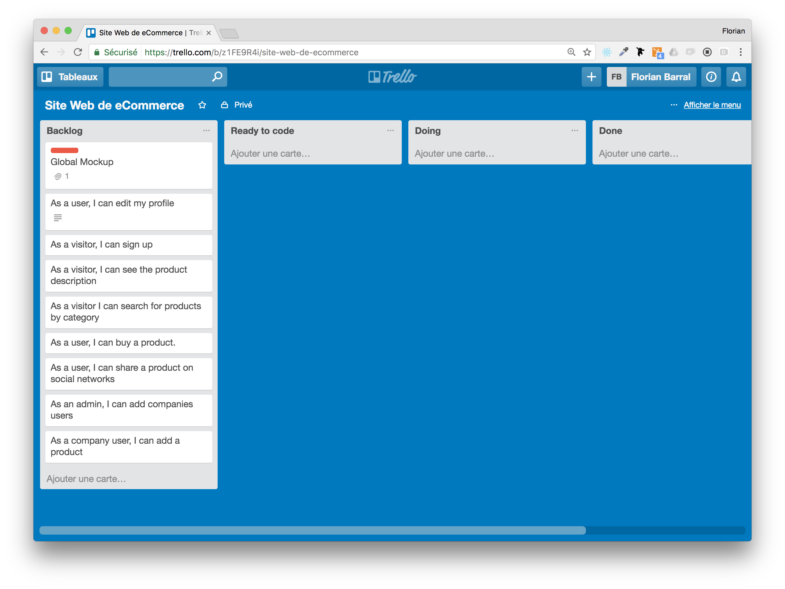
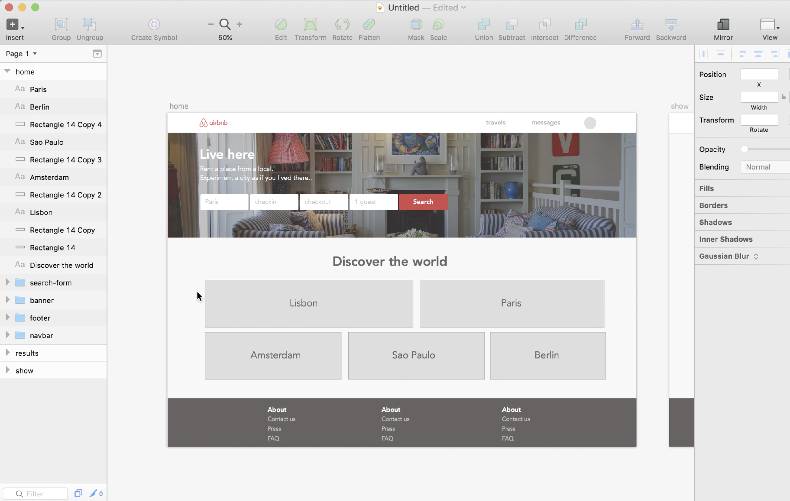

# CONSTRUCTION FONCTIONNELLE D'UN PROJET WEB
## OBJECTIF
L'objectif de ce travail est de vous projeter dans un cas réel. Il s'agit de vous exercer à travailler en équipe sur la Définition & la Conception d'un projet Web : étapes préliminaires en gestion de projet séquentielle et également en gestion de projet agile (dans ce cas on parle du "sprint 0 ou itération 0") .

Dans cet exercice, en tant qu'**équipe de projet**, vous vous concentrerez sur les spécifications fonctionnelles du projet et vous présenterez un document qui puisse être présenté aux développeurs et servir tout au long du projet de support de communication entre l'équipe de projet (vous) et l'équipe réalisatrice (les développeurs). Pour rappel, comme nous travaillons en méthode agile, ce support pourra être alimenté et modifié en cours de route en fonction des retours utilisateurs.

## TRAVAIL A FAIRE
### 0. Constitution d'une équipe projet
Groupes de 4 ou 5 personnes.

### 1. Choix du projet Web à réaliser
Choisissez une start-up pour laquelle vous réaliserez le site Web dynamique (existante ou virtuelle).

### 2. Conception du projet Web
#### a)  Définition du périmètre du projet Web
**i. Target**
Qui sont les utilisateurs & clients de mon service ? Caractérisez les différents profils-types extrèmes(personas) de vos utilisateurs potentiels : personalités, besoins, etc.
[Lien utile 1](https://openclassrooms.com/courses/apprehendez-la-demarche-ux-en-pratique/creez-trois-personas-a-partir-des-profils-utilisateur) -
[Lien utile 2](https://openclassrooms.com/courses/decouvrez-les-fondamentaux-de-l-ux-design/definissez-un-persona) -
[Lien utile 3](http://www.weloveusers.com/formation/apprendre/personas.html)
Bien définir les cas extrèmes d'utilisateurs potentiels(personas) permet de cerner un maximum d'utilisateurs et de synthétiser et formaliser les besoins communs importants à satisfaire.

**ii. Pain**
Ainsi, la question à se poser est : qu'ont-ils tous en commun dans leurs souffrances ? Quels sont leurs principaux besoins (conscients ou inconscients) ? Formalisez ces besoins clairs et précis.

**iii. Solution**
Comment répondre à ces besoins avec une plateforme Web ? Quel est le service proposé ? Comment est-il vendu ? A quel prix ?

#### b) Fonctionnalités à développer
**Il s'agit de décrire au mieux les fonctionnalités du site Web dynamique. Pour cela, vous devez proposer tout ou partie des fonctionnalités du site Web sous forme de [user stories](https://fr.wikipedia.org/wiki/R%C3%A9cit_utilisateur)** (au moins 10 user stories). Pour rappel, les user stories sont des phrases simples utilisées en méthode agile afin de décrire clairement aux developpeurs les fonctionnalités à développer.

Exemples de User Stories simples en suivant le schéma "En tant que (WHO?), je peux ... (DO WHAT?)".
- En tant que visiteur, je peux m'inscrire ou me connecter au service.
- En tant qu'administrateur, je peux ajouter un produit.
- En tant qu'utilisateur particulier (identifié), je peux acheter un produit.
- En tant qu'utilisateur particulier (identifié), je peux partager sur les réseaux sociaux le produit en question.

#### c) Réalisation de vos mockups ou maquettes
Réalisez des magnifiques maquettes visuelles du site Web pour bien illustrer et clarifier vos user stories à l'équipe de développement (au moins 4 écrans différents du site Web).

Pour cela, vous utiliserez les applications suivantes : [Sketchapp](https://www.sketchapp.com/) (le mieux) ou [Inkscape](https://inkscape.org/fr/) (et [Marvel](https://marvelapp.com/) si vous souhaitez rendre dynamiques vos mockups)

Voici des videos pour prendre en main [Sketchapp](https://www.sketchapp.com/) [Marvel](https://marvelapp.com/) :
- [Comment faire en 15 min un mockup de Airbnb sur Sketch ?](
https://www.youtube.com/watch?v=zR-6RW3kHyM)
- [Comment dynamiser et interconnecter des mockups avec Marvel ?](
https://youtu.be/4CyMMypeTtY?t=49m37s)

On ne naît pas designers, on le devient ~~en copiant ;)~~ en s'inspirant de l'existant sur le Web.
- Templates SketchApphttps : //www.sketchappsources.com/tag/kit.html
    - https://www.sketchappsources.com/free-source/2607-drewbery-landing-page-sketch-freebie-resource.html
    - https://www.sketchappsources.com/free-source/2557-website-starter-page-kit-sketch-freebie-resource.html
    - https://www.sketchappsources.com/free-source/2232-wordpress-landing-page-theme-sketch-freebie-resource.html
    - https://www.sketchappsources.com/free-source/1968-hofmann-responsive-web-ui-kit-sketch-freebie-resource.html
    - https://www.sketchappsources.com/free-source/1237-real-estate-landing-page-template-sketch-freebie-resource.html
- http://collectui.com/
- http://www.calltoidea.com/
- https://dribbble.com/
- https://goodui.org/
- https://www.awwwards.com/

### 3. Exposé PowerPoint de 10 minutes maximum, la semaine du 15 mai 2017
- Présentation des réalisations : pitch + mockups + user stories
- Auto-évaluation : étes-vous satisfaits de votre résultat ? Quels ont été les facteurs bloquants ? Comment pourriez-vous les prolonger ?

A vous de jouer !
