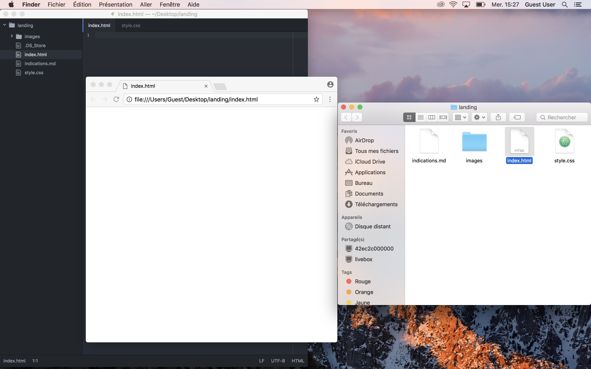
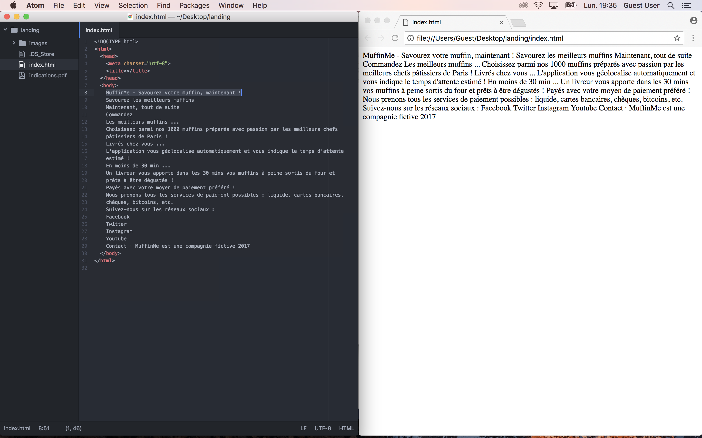
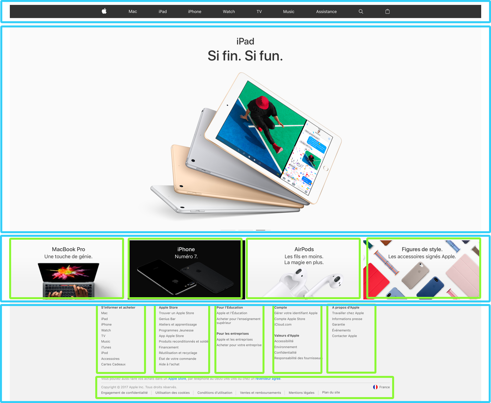
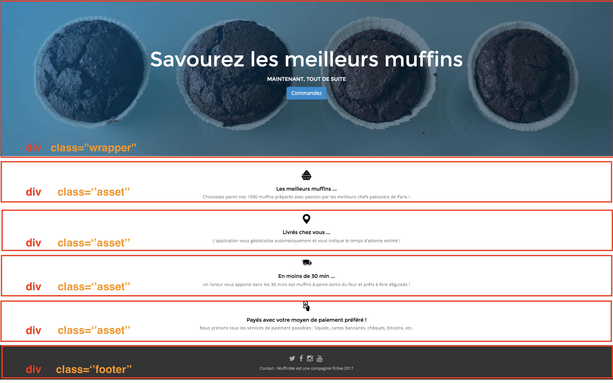
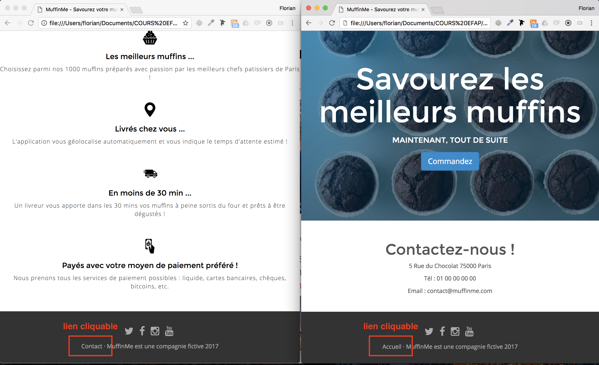
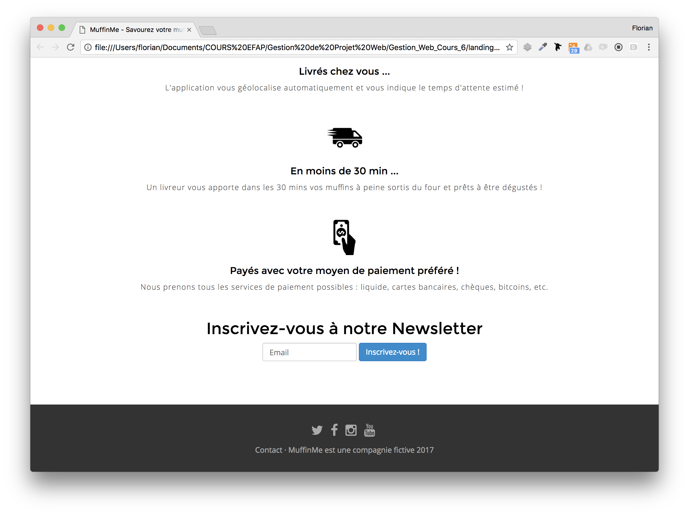

# Tutoriel HTML/CSS destiné aux élèves de l'EFAP 3A 2016-2017

## Avant-propos
L'objectif de cette introduction au HTML/CSS est de :
  - Comprendre le HTML & CSS en mettant les mains dans le cambouis : vous allez coder un site Web composé de deux pages Web statiques (en faisant des copier-coller principalement #tranquillou 😎😎!)
  - Savoir ce qui se passe derrière un CMS (Wordpress, Jumla, etc) et éventuellement pouvoir personnaliser certains éléments HTML/CSS si c'est possible sur le CMS utilisé

Pour atteindre cet objectif, grâce aux quelques notions vues en classe (prérequis indispensables : balises/attributs HTML et exemples, squelette HTML, selecteurs/propriétés CSS et exemples), nous allons coder un site Web statique d'une start-up livrant à domicile des muffins. Le site Web sera composé de deux pages Web statiques et sera codé et visualisé en "local" sur votre ordinateur : nous ne nous intéresserons pas à le mettre en ligne sur le Web. (c'est-à-dire à réaliser l'hébergement du site Web sur un serveur Web d'Internet).

## Consignes à respecter
- Réalisez le tutoriel et faites le maximum de choses possibles (vous pouvez tout reussir très facilement jusqu'au 3.8 😉)
- Renommez le dossier "landing" de la sorte "landing_EFAP_301_DUPONT_Martin"
- Compressez le dossier en zip (clic droit sur le dossier > Compresser).

- Envoyez-moi par mail le dossier compressé avec l'objet "Landing EFAP 301 DUPONT Martin"

Bon courage !

# 1. Organisons notre plan de travail !
Nous allons nous assurer d'avoir le parfait environnement de travail pour coder proprement notre page Web.
### Outil nº1 : Editeur de Texte
1. Installez l'éditeur de texte : [Atom](https://atom.io/) (éditeur de texte pour développeurs).
2. Ouvrez l'éditeur et allez personnaliser deux petits paramètres de l'application : Menu "Atom" > "Parameters" (ou Settings sur PC) > "Editor" > Cochez les options "Show Indent Guide" & "Show Invisibles". (ceci va nous aider à indenter proprement : cf. suite). Fermez ensuite tous les onglets présents de façon à avoir :


3. Récupérez le dossier ["landing"](https://github.com/barralf/landing-efap-instructions/blob/master/landing.zip) avec les images (téléchargez-le en cliquant sur le bouton `Download`). Glissez/déposez le dossier dans l'éditeur de texte. (#DragAndDrop)
4. Sur l'arbre de navigation de gauche, dans le dossier "landing":
  - clic droit : New file. Le sauvegarder sous le nom `index.html`.
  - faire la même chose pour `style.css`.

### Outil nº2 : Navigateur Web
5. Sur le Finder, double cliquez sur le fichier `index.html` : le fichier s'ouvre automatiquement avec votre navigateur Web par défaut. Vous devriez visualiser une page blanche, ce qui est rassurant car le fichier `index.html` est vide !

NB : Vous pouvez vous amuser à utiliser l'inspecteur navigateur (clic droit--> Inspecter) pour accéder au code HTML/CSS de la page consultée et faire quelques changements insolites en local ! (puisque vous travaillez en local et pas sur le serveur hébergeant le site, il n'y a que vous, en tant que client, qui pourrez visualiser vos changements : sinon tout le monde pourrez modifier le site de Facebook ! )


6. Pour faciliter les choses pour la suite : partagez votre plan de travail en deux : éditeur de texte à gauche et navigateur Web à droite. Cf :

7. Votre plan de travail de parfait développeur est là : vous êtes prêts pour la suite !

# 2. Construisons et structurons notre page HTML !

## 2.1. Insérons le squelette standard d'une page `.html`
* Dans votre document `"index.html"`, tapez `html` et taper sur la touche `Tab` de votre clavier (Raccourci clavier suite à la suggestion d'Atom)

* Que de temps gagné ! Comme par miracle, tout le squelette standard d'une page HTML apparaît :
    - la doctype de votre document : `<!DOCTYPE html>`
    - les balises `<html>`, `<head>` et `<body>`
    - les balises `<meta charset="UTF-8">` (pour les caractères spéciaux) et `<title>` dans le `<head>`


* Les balises d'une page HTML peuvent être pensées comme des **poupées russes** : ```<title>``` est dans le ```<head>``` qui est lui-même dans le ```<html>```. Pour bien visualiser cette image de poupées russes, on fera attention à indenter proprement le code afin d'avoir un code lisible rapidement. Une indentation se fait avec la touche `Tab` (ce qui correspond à deux espaces)

```html
<!DOCTYPE html>
<html>
  <head>
    <meta charset="utf-8">
    <title></title>
  </head>
  <body>
    <h1> </h1>
    <p> </p>
  </body>
</html>
```
au lieu de
```html
<!DOCTYPE html>
<html>
<head>
<meta charset="utf-8">
<title></title>
</head>
<body>
<h1> </h1>
<p> </p>
</body>
</html>
```

* ❗️Attention❗️: une balise qui est ouverte à l'intérieur d'une autre balise doit être fermée à l'intérieur. Il faut faire attention à ce que les balises ne s'entremêlent pas !

## 2.2. Ajoutons notre contenu et balisons le !
* Copiez collez le contenu ci-dessous dans le `<body>` et assurez vous de bien aligner le texte (selectionnez le texte à indenter et appuyez sur la touche `Tab`)

```html
<!-- Texte à copier-coller dans le body et à mettre en forme -->
MuffinMe - Savourez votre muffin, maintenant !

Savourez les meilleurs muffins

Maintenant, tout de suite

Commandez


Les meilleurs muffins ...
Choisissez parmi nos 1000 muffins préparés avec passion par les meilleurs chefs pâtissiers de Paris !

Livrés chez vous ...
L'application vous géolocalise automatiquement et vous indique le temps d'attente estimé !

En moins de 30 min ...
Un livreur vous apporte dans les 30 min vos muffins à peine sortis du four et prêts à être dégustés !

Payés avec votre moyen de paiement préféré !
Nous prenons tous les services de paiement possibles : liquide, cartes bancaires, chèques, bitcoins, etc.


Suivez-nous sur les réseaux sociaux :
Facebook
Twitter
Instagram
Youtube

Contact · MuffinMe est une compagnie fictive 2017
```

* En sauvegardant le fichier HTML (le point bleu dans l'onglet `index.html` disparaît), rechargez la page de votre navigateur, vous devriez avoir :


Le résultat est décevant, n'est-ce pas ? Pas de panique ! C'est normal car nous n'avons pas encore touché au HTML/CSS !

* Replacez bien le titre de la page entre les balises `<title>` pour avoir :


* Structurez le tout avec les balises `<h1>, <h2>, <h3>, <h4>, <h5>, <h6>, <p>, <ul> & <li>` (/!\ Ne pas oublier les balises fermantes à chaque fois !) pour avoir :


## 2.3. Ajoutons des liens !
Ajoutez-y les liens (balise `<a>` avec l'attribut `href` pour spécifier l'URL du lien) afin d'être redirigé vers le réseau social approprié en cliquant dessus. (à noter, si vous pouvez rajouter l'attribut facultatif `target="_blank"` pour que la page s'ouvre dans un nouvel onglet : meilleure UX !)
```html
<!-- Code à copier-coller au bon endroit -->
<a href="https://www.facebook.com/muffinme" target="_blank"> Facebook </a>
<a href="https://www.twitter.com/muffinme"> Twitter </a>
<a href="https://www.instagram.com/muffinme"> Instagram </a>
<a href="https://youtube.com/muffinme"> Youtube </a>
```
## 2.4. Ajoutons des images !
Ajoutez-y les images/icônes au dessus de chaque caractéristique. Pour cela, vous allez utiliser la balise `` (/!\ la balise `` est une exception car il s'agit d'une balise _orpheline_ et sans balise fermante `</img>`!!) avec l'attribut `src` pour signifier la source et indiquer où se trouve l'image que l'on veut insérer et `alt` pour spécifier le texte alternatif affiché si mauvais téléchargement de l'image et qui est important pour le référencement


```html
<!-- Code à copier-coller au bon endroit -->


<!-- vous pouvez changer la largeur de l'icon en mettant une valeur de width de 65 pixels -->
```
A ce stade, on est parvenu à une page Web structurée et lisible bien qu'un peu archaïque. En fait, les premières pages Web ressemblaient à ça et en particulier celles du [premier site Web historique](http://info.cern.ch/hypertext/WWW/TheProject.html) . Vous êtes donc au niveau de la crème de la crème des chercheurs scientifiques du monde ... mais des années 90 ! 😜


# 3. Stylisons notre page avec le CSS !

Evidemment les pages Web d'aujourd'hui ne ressemblent pas à ça grâce au CSS qui permet de _styliser_ les différents élements de la page HTML et d'avoir des pages beaucoup plus agréables à consulter ! L'objectif final étant :


## 3.1. Importons notre feuille de style CSS dans notre feuille HTML

Relions le fichier CSS (`style.css` créé au début) à la page HTML (`index.html`) dans le `<head>` grâce a la balise `<link>`.
```html
<!-- Code à copier-coller au bon endroit -->

<head>
  [...]
  <link href='style.css' rel='stylesheet'>
</head>
```

## 3.2. Ajoutons des couleurs et des jolies polices
Complétons notre feuille de style maintenant qu'elle est reliée au fichier HTML.

```css
/*Rappel du formalisme CSS : un sélecteur et ses règles de style (une règle de style c'est une proprieté associée à sa valeur)*/
selector {
  property1: value1;
  property2: value2;
}
```

```css
/*Code à copier-coller au bon endroit*/

body {
  color: #555;
  text-align: center;
}

h4 {
  color: black
}
```

Rajoutons des polices plus sympathiques que le Times New Roman. Pour éviter la situation où le client ne va pas visualiser la bonne police de la page Web (faute de l'avoir installée sur son ordinateur si la police souhaitée est disons exotique!), on va pré-télécharger dans le `<head>` grâce au service Google Font les polices que nous allons utiliser dans notre feuille de style : comme ça tout le monde visualisera la page avec les bonnes polices quelque soit son ordinateur !
```html
<!-- Code à copier-coller au bon endroit -->

<head>
  [...]
  <link href="https://fonts.googleapis.com/css?family=Montserrat|Open+Sans:300,400,700" rel="stylesheet">
  <link href='style.css' rel='stylesheet'>
</head>
```
avant de les spécifier dans la feuille de style.
```css
/*Code à copier-coller au bon endroit*/

body {
  font-family: "Open Sans", sans-serif;
  color: #555;
  text-align: center;
}

h1, h2, h3, h4 {
  font-family: "Montserrat", sans-serif;
}

h4 {
  color: black
}
```
NB : vous pouvez rajouter à votre guise des règles de style CSS en parcourant notamment cette [liste des propriétés CSS]( http://cssreference.io/) (d'autres liens sont également en fin de document)

## 3.3. Structurons notre page avec des div !

En fait, les éléments balisés d'une page Web sont rassemblés dans des blocs eux-mêmes balisés : on pousse encore plus loin l'image des "poupées russes". Ainsi, la page d'accueil d'Apple est constituée de blocs dans lesquels il y a d'autres sous-blocs où on retrouve des sous-sous-blocs ...(ainsi de suite)... jusqu'à ce qu'on trouve les balises HTML traditionnelles (`h1, p, a, ul, li, img ...`) :



Pour baliser un bloc, on utilise les balises `<div class="">` (ouvrante) et `</div>` (fermante).

On remarque l'attribut facultatif `class="nom_de_classe_du_bloc"` de la balise ouvrante qui va servir de sélecteur dans le `.css` auquel on va attribuer des règles de styles qui s'appliqueront à toutes les div de classe `"nom_de_classe_du_bloc"` (et à ce qu'il y a à l'interieur aussi).

On va baliser notre page de la façon suivante avec 6 div associées à 3 classes différentes :



```html
<!DOCTYPE html>
<html>
  <head>
    <meta charset="utf-8">
    <title> MuffinMe - Savourez votre muffin, maintenant !</title>
    <link href="https://fonts.googleapis.com/css?family=Montserrat|Open+Sans:300,400,700" rel="stylesheet">
    <link rel="stylesheet" href="style.css">
  </head>
  <body>

    <div class="wrapper">
      <!-- code HTML du haut de page -->
    </div>

    <div class="asset">
      <!-- code HTML de la 1ère caractéristique du service MuffinMe-->
    </div>

    <div class="asset">
      <!-- code HTML de la 2ème caractéristique du service MuffinMe-->
    </div>

    <div class="asset">
      <!-- code HTML de la 3ème caractéristique du service MuffinMe-->
    </div>

    <div class="asset">
      <!-- code HTML de la 4ème caractéristique du service MuffinMe-->
    </div>

    <div class="footer">
      <!-- code HTML du bas de page-->
    </div>
  </body>
</html>

```

## 3.4. Utilisons une librairie sympathique d'icônes : Fontawesome !
On va prétélécharger dans le `<head>` une bibliothèque d'icônes [Fontawesome](http://fontawesome.io/icons/)

Le `<head>` de notre page HTML devient donc :
```html
<!-- s'assurer que votre head correspond à celui-ci en copiant collant le code -->
<head>
  <meta charset="utf-8">
  <title> MuffinMe - Savourez votre muffin, maintenant !</title>
  <link rel="stylesheet" href="https://maxcdn.bootstrapcdn.com/font-awesome/4.1.0/css/font-awesome.min.css">
  <link href="https://fonts.googleapis.com/css?family=Montserrat|Open+Sans:300,400,700" rel="stylesheet">
  <link rel="stylesheet" href="style.css">
</head>
```
Aussi, on va remplacer le nom de chaque réseau social par l'icône associée avec les balises ``` <i class=""></i>```
```html
<div class="footer">
  <ul>
    <li>
      <a href="https://twitter.com/iceme">
        <i class="fa fa-twitter"></i>
      </a>
    </li>
    <li>
      <a href="https://facebook.com/iceme">
        <i class="fa fa-facebook"></i>
      </a>
    </li>
    <li>
      <a href="https://instagram.com/iceme">
        <i class="fa fa-youtube"></i>
      </a>
    </li>
    <li>
      <a href="https://youtube.com/iceme">
        <i class="fa fa-instagram"></i>
      </a>
    </li>
  </ul>
</div>
```
Vérifiez que vos liens redirigent bien vers les bons réseaux sociaux et qu'ils s'ouvrent bien dans la même page ou dans un nouvel onglet selon l'ajout de l'attribut `target=_blank`. Corrigez s'il le faut. 😉

## 3.5. Profitons du framework CSS : Bootstrap
On va prétélécharger dans le head un framework CSS [Bootstrap](http://getbootstrap.com/css/) clé en main qui a été developpée par Twitter et dont on va utiliser les classes de CSS préfabriquées sans les écrire dans notre feuille de style `style.css` . On va gagner un petit peu de temps !

On va donc utiliser la class `list-inline` de Bootstrap pour rendre la liste horizontale et enlever les puces, et ajouter une classe `social` que l'on codera après dans notre feuille de style `style.css` .

```html
<!-- Code à copier-coller au bon endroit -->
<div class="footer">
  <ul class="list-inline social">
```
Aussi copiez-collez dans style.css les sélecteurs correspondant aux classes (attention au point `.` précisant qu'on selectionne une classe et pas une balise traditionnelle) avec leurs règles de style associées :

```css
.footer {
  text-align: center;
  background-color: #333;
  color: #aaaaaa;
  padding-top: 30px;
  padding-bottom: 20px;
  margin-top: 80px;
}
.footer a {
  color: #aaaaaa;
}

.footer a:hover {
  color: #dddddd;
}
.social a  {
  font-size: 24px;
}
```

Aussi, on va utiliser un bouton de Bootstrap pour avoir le CallToAction "Commandez". Pour cela on transforme notre titre HTML `h3` en bouton HTML `button` et en utilisant une classe de style spécifique de notre framework CSS :

```html
<!-- Code à copier-coller au bon endroit -->
<button type="button" class="btn btn-primary btn-lg">Commandez</button>
```

## 3.6. Fignolons le CSS

Ajoutez les règles de style ci-dessous. Vous pouvez toutes les comprendre et les deviner (sinon consultez [ce site]( http://cssreference.io/)) ! (aussi assurez-vous de lier la bonne image de fond)
```css
/*règles de style concernant le haut de page*/
.wrapper {
  background-image: linear-gradient(-225deg, rgba(0,101,168,0.6) 0%, rgba(0,36,61,0.6) 50%), url("images/muffins-wrapper.jpg");
  background-size: cover;
  height: 550px;
  color:white;
  text-align: center;
  padding-top: 150px;
  margin-bottom: 50px;
}

.wrapper h1 {
  font-size: 72px;
}

.wrapper h2 {
  font-size: 18px;
  margin-bottom: 1em;
}

/*règles de style concernant les 4 assets de MuffinMe */

.asset {
  text-align: center;
  margin-bottom: 50px;
}

.asset p {
  font-weight: 300;
  letter-spacing: 1px;
}

.asset img {
  margin-bottom: 10px;
}
```

Ça y est : notre page est bien sympathique maintenant !


## 3.7. Challenge nº1 : Créez une page de contact hyperliée à la page d'accueil (EASY)

Dupliquez la page `index.html` et la nommez `contact.html` .

Supprimez les `div class="asset"` et ajoutez une `div class="contact"` dans lequel vous copiez-collez le texte ci-dessous et le mettez en forme comme vous le souhaitez avec les balises `h4, p`, etc.

```html
<!-- Texte à copier coller dans la page contact.html -->

Contactez-nous !
5 Rue du Chocolat 75000 Paris

Tél : 01 00 00 00 00

Email : contact@muffinme.com
```

Enfin, pour naviguer entre les deux pages Web, rajoutez dans les bas de pages en utilisant les bonnes balises des liens `href="contact.html"` et `href="index.html"` de façon à voir les bas de pages suivants :



Ça y est ! Vous pouvez naviguer entre les différentes pages Web statiques de votre site Web MuffinMe ! Magical ! 😋

## 3.8. Challenge nº2 : Insérons un formulaire

Nous souhaitons récupérer les adresses mails des potentiels clients afin de les informer ou bombarder de nos différentes offres exceptionnelles.
Rajoutons en bas de page une inscription à la newsletter de notre service comme ci-joint :



En parcourant la documentation de [Bootstrap](http://getbootstrap.com/css/#forms-inline), nous trouvons le code générique pour un formulaire horizontal :
```html
<form class="form-inline">
  <div class="form-group">
    <label for="exampleInputName2">Name</label>
    <input type="text" class="form-control" id="exampleInputName2" placeholder="Jane Doe">
  </div>
  <div class="form-group">
    <label for="exampleInputEmail2">Email</label>
    <input type="email" class="form-control" id="exampleInputEmail2" placeholder="jane.doe@example.com">
  </div>
  <button type="submit" class="btn btn-default">Send invitation</button>
</form>
```
Copiez-collez ce code dans une div `<div class="text-center"> </div>` après la dernière div `class="asset"` et avant la div `class="footer"` et regardez le résultat sur votre navigateur.
Essayez d'adapter le code pour avoir le résultat escompté : supprimer/modifier/ajouter.

- Indice nº1 : vous devez surtout supprimer des lignes : il doit vous rester 2 lignes dans la balise `<form-inline>`
- Indice nº2 : pour le design, utilisez la même classe de style pour le bouton "Inscrivez-vous" que pour le bouton "Commandez" déjà inséré plus haut (à savoir `btn-primary` au lieu de `btn-default`)


## 3.9. Challenge nº3 (DIFFICILE) : Rendons la page Responsive
Cette partie est vraiment challengeante !

Pour cela, nous allons vouloir créer une "grille responsive" avec Bootstrap qui va dépendre de la largeur de la page et paramétrer ses caractéristiques en fonction de la largeur de la fenêtre du navigateur Web (`xs` : Petit écran (smartphone) ; `sm` : Écran réduit (tablette) ; `md`: Écran moyen (ordinateur portable) ; `lg` : Grand écran (ordinateur fixe) ).

Nous souhaitons rendre la page Responsive à savoir faire en sorte que les `div` se positionnent d'une certaine façon.

- Quand la largeur de la fenêtre du navigateur est petite (en dessous de `sm`), les 4 `div class="assets"` se positionnent les unes au-dessus des autres.
- Quand la largeur de la fenêtre du navigateur est moyenne (au-dessus de `sm` mais en dessous de `md`), nous souhaitons que les 4 `div class="assets"` se positionnent deux sur deux étages.
- Quand la largeur de la fenêtre du navigateur est grande (au-dessus de md), nous souhaitons que les 4 `div class="assets"` se positionnent toutes côte à côte.


Consultez ces liens pour trouver la solution :
- https://openclassrooms.com/courses/prenez-en-main-bootstrap/une-grille
- http://getbootstrap.com/examples/grid/
- https://www.youtube.com/watch?v=-9ZheXYOMeM&feature=youtu.be&t=1h23m24s

Pour vous aider, le responsive du footer sera codé de la façon suivante :

```html
<div class="footer">
  <div class="container">
    <div class="row">
      <div class="col-xs-6 col-sm-3">
        <ul class="list-inline social">
          <li>
            <a href="https://twitter.com/iceme">
              <i class="fa fa-twitter"></i>
            </a>
          </li>
          <li>
            <a href="https://facebook.com/iceme">
              <i class="fa fa-facebook"></i>
            </a>
          </li>
          <li>
            <a href="https://instagram.com/iceme">
              <i class="fa fa-instagram"></i>
            </a>
          </li>
          <li>
            <a href="https://youtube.com/iceme">
              <i class="fa fa-youtube"></i>
            </a>
          </li>
        </ul>
      </div>
      <div class="col-xs-6 col-sm-9 text-right">
        <p>
          <a href="contact.html"> Contact </a>
          · MuffinMe est une compagnie fictive 2017
        </p>
      </div>
    </div>
  </div>
</div>
```

A vous maintenant de faire la partie concernant les 4 `div class="assets"` 😉

# 4. Conclusion & Debriefing
Si vous en êtes arrivé jusque là, BRAVO ! 🤙💪👍👏
Pour résumer, ensemble nous avons fait beaucoup de choses :
- structuré le contenu d'une page Web grâce aux balises HTML
- stylisé les éléments balisés :
  - à la main dans le fichier CSS `style.css`
  - en important des polices et icônes sympathiques
  - en utilisant un framework CSS pour styliser plus vite en utilisant des classes préfabriquées !
- lié deux pages Web statiques d'un site Web
- rajouté un formulaire en utilisant et en adaptant des composants préfabriqués CSS
- et peut-être rendu une page Web responsive (c'est dur ça ^^...)

# Pour aller plus loin
Voici des liens utiles et très intéressants !
- Web Design in 4 minutes : http://jgthms.com/web-design-in-4-minutes/ (really nice one !)
- Learn more about HTML/CSS : http://marksheet.io/ (nice one !)
- Liste des balises HTML https://developer.mozilla.org/fr/docs/Web/HTML/Element
- Liste des propriétés CSS : http://cssreference.io/ (very good one !)
- Liste 2 des propriétés CSS : https://developer.mozilla.org/fr/docs/Web/CSS/Reference
- Tutoriel 1 HTML/CSS OpenClassrooms : https://openclassrooms.com/courses/prenez-en-main-bootstrap (very complete one but long)
- Tutoriel 2 HTML/CSS Le Wagon : http://bit.ly/2dS5cC8 (**excellent** one and really efficient but you need to pay ... :S )
